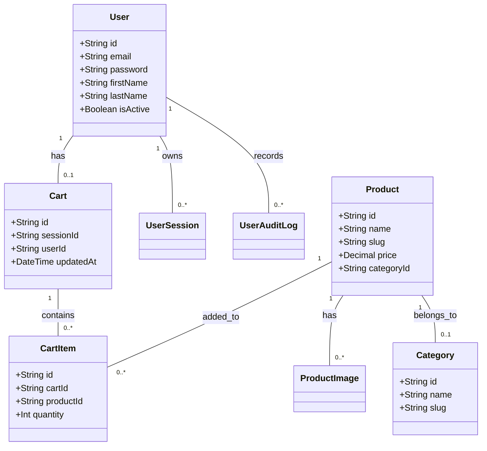
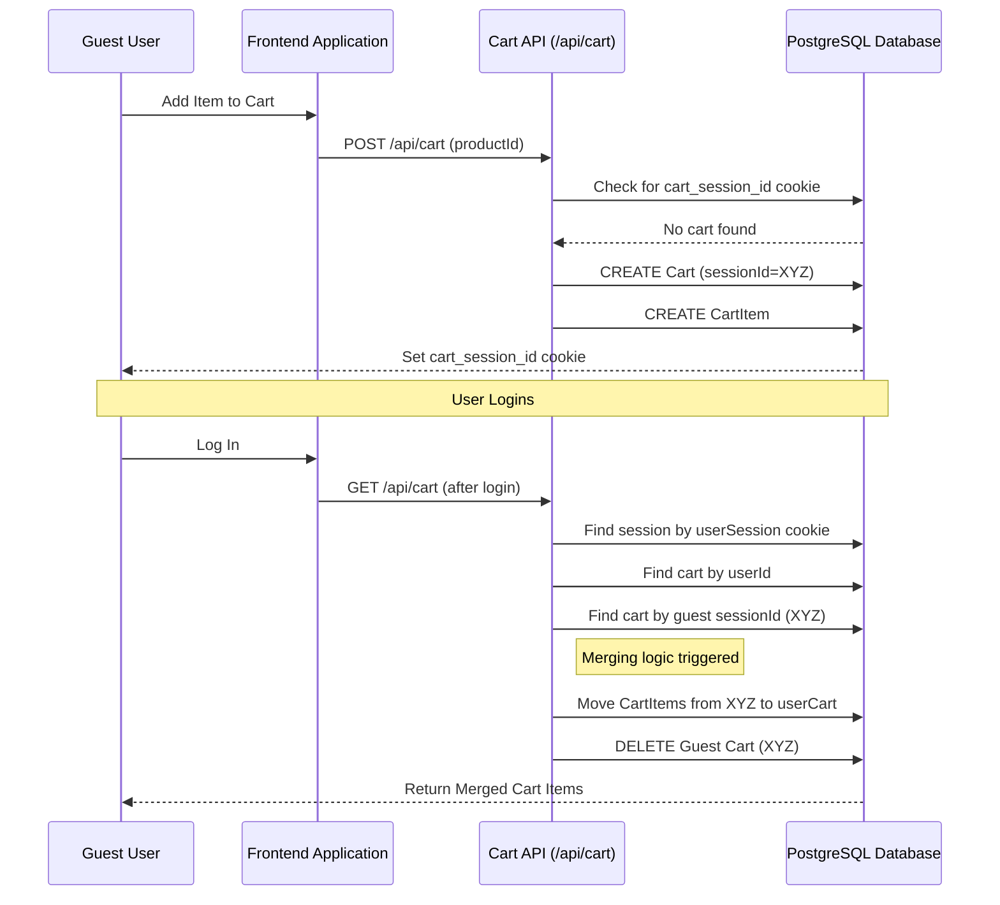

# Novraux Architecture & Database Guide

This document provides a technical overview of the Novraux e-commerce system, including the database schema, authentication flows, and shopping cart logic.

---

## 🏗️ System Architecture (UML)

### **Class Diagram (Data Models)**
The following diagram illustrates the core data entities and their relationships.

### **Authentication & Cart Flow**
This sequence diagram shows how guest carts are merged into user accounts upon login.

---

## 📊 Database Schema (Prisma)

The project uses **Prisma** with a **PostgreSQL** database. Below is the breakdown of the most critical models.

### **1. Product Models**
- **`Product`**: Stores name, price, description, and SEO metadata.
- **`ProductImage`**: Linked to products, supports multiple images with an order and primary flag.
- **`Category`**: Hierarchical organization for products.

### **2. Commerce Models**
- **`Cart`**: Unique by `sessionId` (for guests) and `userId` (for logged-in users).
- **`CartItem`**: Junction table between `Cart` and `Product`, tracking quantities.

### **3. User & Auth Models**
- **`User`**: Main customer account table.
- **`UserSession`**: Tracks active login tokens, IP addresses, and user agents.
- **`UserAuditLog`**: Security tracking for all authentication events.
- **`AdminUser` / `AdminSession`**: Separate tables for the backoffice management staff.

---

## 🔒 Security Summary
- **Password Hashing**: All passwords are encrypted using `bcryptjs` with 10 salt rounds.
- **Session Tokens**: 32-byte hex strings generated via `crypto.randomBytes`.
- **Cookies**: HTTP-Only, Secure (in production), and SameSite=Lax to prevent CSRF.
- **Middleware**: Server-side route protection for both `/admin` and `/account` segments.
